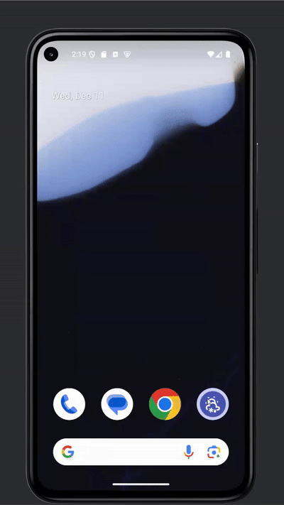
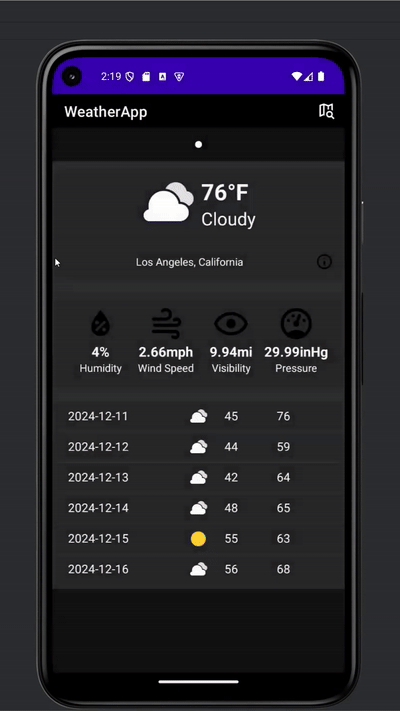
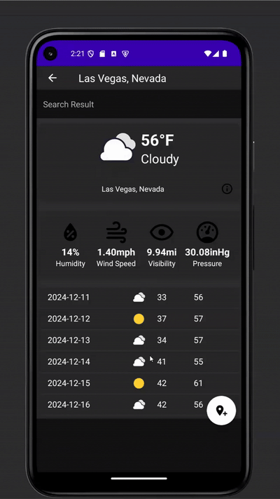
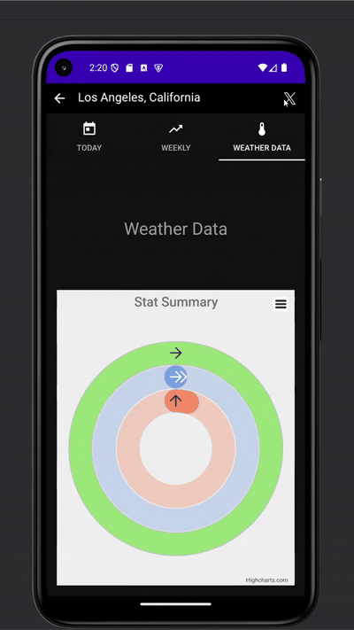

# 🌤️ Android Weather App

A fully-featured Android weather application that provides real-time forecasts using the Tomorrow.io API. Built with Java, Android SDK, MongoDB, and a custom Node.js backend, this app enables users to view detailed weather data, manage favorite cities, and share weather updates via X(Twitter).

---

## 📌 Features

- 🌍 **Current Location Weather**: Auto-detect location and display summary.
- 🔍 **City Search with Autocomplete**: Google-style search bar with suggestions.
- 📊 **Three Detailed Tabs**:
  - Today: Real-time weather conditions
  - Weekly: Forecast with interactive Highcharts graphs
  - Weather Data: Humidity, precipitation, cloud cover
- ⭐ **Favorites**: Add/remove cities with persistent storage in MongoDB Atlas.
- 🐦 **Tweet Integration**: Share weather summaries directly on Twitter.
- ⚡ **Smooth UI/UX**: Splash screen, tab layout, progress bars, ripple animations.

---

## 📸 Demo

### 🔹 Main Functionalities (Side-by-Side)

<div style="display: flex; gap: 10px;">
  
  
  
</div>

### 🔹 Favorites & Tweet

<div style="display: flex; gap: 10px; margin-top: 15px;">
  
  
</div>


You can find the full-length demo video at the bottom of README

---


## Tech Stack

| Layer      | Technologies                         |
|------------|--------------------------------------|
| Frontend   | Java, Android SDK, XML               |
| Backend    | Node.js, Express.js, Axios           |
| Database   | MongoDB Atlas                        |
| APIs       | [Tomorrow.io Weather API](https://www.tomorrow.io/) |
| Libraries  | Volley, Highcharts, Picasso, Glide   |
| Tools      | Android Studio, Gradle               |

---

## 📁 Project Structure

```
android_mobile/
├── app/
│   └── src/
│       ├── main/
│       │   ├── java/com/example/myapplication/       # Activities, Fragments, Utilities
│       │   └── res/                                   # Layouts, icons, menus, styles
│       │       ├── layout/                            # XML UI files
│       │       ├── drawable/                          # Tab icons & splash images
│       │       ├── menu/                              # Toolbar menus
│       │       ├── values/                            # Colors, strings, styles
│       │       └── api/                               # Tomorrow.io icon mappings
├── gradle/                                            # Gradle wrapper
└── backend/
    ├── app.js                                         # Node.js entry point
    ├── routes/                                        # API endpoints
    └── utils/                                         # API logic and MongoDB interface
```

---

## Getting Started

### Prerequisites
- Android Studio (Pixel 5 Emulator recommended)
- Node.js (v18+) and npm
- MongoDB Atlas account
- Tomorrow.io API key

### Setup

1. **Frontend (Android)**
   ```bash
   cd android_mobile/
   open in Android Studio
   ```

2. **Backend (Node.js)**
   ```bash
   cd backend/
   npm install
   npm start
   ```

3. **API Configuration**
   - Set your Tomorrow.io API key in `server.js` for backend
   - Ensure backend is accessible from Android emulator

---

## Video Demo
<video controls src="https://private-user-images.githubusercontent.com/86525458/443847668-6ac2f0ff-ea4d-4a7c-91fc-6ba30e6ed9b0.mp4?jwt=eyJhbGciOiJIUzI1NiIsInR5cCI6IkpXVCJ9.eyJpc3MiOiJnaXRodWIuY29tIiwiYXVkIjoicmF3LmdpdGh1YnVzZXJjb250ZW50LmNvbSIsImtleSI6ImtleTUiLCJleHAiOjE3NDcyNTc2MTQsIm5iZiI6MTc0NzI1NzMxNCwicGF0aCI6Ii84NjUyNTQ1OC80NDM4NDc2NjgtNmFjMmYwZmYtZWE0ZC00YTdjLTkxZmMtNmJhMzBlNmVkOWIwLm1wND9YLUFtei1BbGdvcml0aG09QVdTNC1ITUFDLVNIQTI1NiZYLUFtei1DcmVkZW50aWFsPUFLSUFWQ09EWUxTQTUzUFFLNFpBJTJGMjAyNTA1MTQlMkZ1cy1lYXN0LTElMkZzMyUyRmF3czRfcmVxdWVzdCZYLUFtei1EYXRlPTIwMjUwNTE0VDIxMTUxNFomWC1BbXotRXhwaXJlcz0zMDAmWC1BbXotU2lnbmF0dXJlPTgxOTgwMWUxNzAzYjIwMjk0M2IxOGM5OGM2NWY3ZmU0Yzc2YmNhMmFkYTMxYjZkNmRmNGI4MjgzNDIxNzI2ZWImWC1BbXotU2lnbmVkSGVhZGVycz1ob3N0In0.slpTSQgGLBxK7pEfANL5HNor51Odp0djXKkGTf6wHis" title="Title" width = 30%></video>


